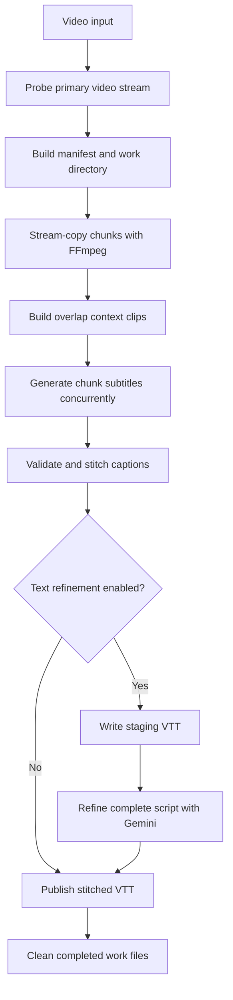

# Project specification

## Agent skills

### Issue tracker

Track issues in GitHub Issues for `gotenksIN/video-subtitler`. See `docs/agents/issue-tracker.md`.

### Triage labels

Use the five default triage labels. See `docs/agents/triage-labels.md`.

### Domain docs

Use the single-context domain layout. See `docs/agents/domain.md`.

This file is the source of truth for agents that work on this repository.
It describes the project from first principles.
Read it before changing code, tests, scripts, or operational documentation.

## Purpose

This project is a Python command-line tool that creates English WebVTT subtitles from video.
It sends video clips to the Google Gemini API.
It targets accurate speech timing, faithful translation, and useful on-screen text.
It also has a second Gemini pass that improves the complete subtitle script.

The design favors throughput and resumability.
FFmpeg performs local media work.
The Gemini API performs video interpretation and translation.
Pydantic validates every structured model response before it reaches the output file.

## System model

The normal generation path has seven stages.



The command holds one process lock for the complete work-directory lifecycle.
The lock covers splitting, clip creation, API calls, output publication, and success cleanup.

## Repository layout

| Path | Responsibility |
| --- | --- |
| `gemini_subs.py` | Main CLI, media pipeline, Gemini calls, validation, stitching, and refinement. |
| `tests/test_gemini_subs.py` | Unit and integration-style tests for the main module. |
| `scripts/subtitle.sh` | Local wrapper that uses the default API worker count. |
| `scripts/yt-dl.sh` | Single-video YouTube downloader. |
| `scripts/ffmpeg.sh` | Headless static FFmpeg installer. |
| `scripts/benchmark.py` | Full-video matrix benchmark across generation and refinement models. |
| `README.md` | User-facing installation and usage guide. |
| `.env.example` | Environment variable template. |
| `pyproject.toml` | Python metadata and dependency declarations. |
| `temp_video_chunks/` | Resumable run state. It is temporary and should not be committed. |

Keep `gemini_subs.py` as one focused module unless the file becomes unmanageable.
Use the standard library for small utilities.
Do not add heavy media libraries when an FFmpeg subprocess is sufficient.

## Runtime requirements

The project requires Python 3.14 or newer.
Use `uv` for dependency installation and tool execution.

Runtime dependencies are:

- `google-genai>=2.0.0` for Gemini API access.
- `pydantic>=2.13.4` for response schemas and validation.
- `python-dotenv>=1.2.2` for `.env` loading.
- `webvtt-py>=0.5.1` for VTT reading and writing.

Development dependencies are:

- `pytest>=8.4.2` for tests.
- `ruff>=0.15.18` for linting and formatting.

Install the Python environment from the repository root:

```bash
uv sync
```

The CLI also requires `ffmpeg` and `ffprobe` in `PATH`.
Use a headless GPL static build in WSL or Ubuntu Server environments.
The supported installer downloads BtbN FFmpeg Builds releases.

```bash
./scripts/ffmpeg.sh
export PATH="$HOME/.local/bin:$PATH"
```

The installer supports `x86_64`, `amd64`, `aarch64`, and `arm64` Linux hosts.
It requires `tar`, `mktemp`, and either `curl` or `wget`.
It installs both binaries with mode `0755` into `~/.local/bin`.

## Configuration

`python-dotenv` loads `.env` when `gemini_subs.py` starts.
The shell environment and CLI arguments can also provide these values.
CLI arguments take precedence over environment variables.

| Variable | CLI option | Default | Use |
| --- | --- | --- | --- |
| `GEMINI_API_KEY` | `--api-key` | None | Required Gemini credential. |
| `GEMINI_API_BASE` | `--base-url` | SDK default | Optional Gemini-compatible proxy URL. |
| `GEMINI_MODEL` | `--model` | `gemini-3.7-flash` | Chunk video model. |
| `GEMINI_REFINE_MODEL` | `--refine-model` | `gemini-3.1-pro-preview` | Full-script refinement model. |

The chunk thinking level accepts `minimal`, `low`, `medium`, and `high`.
It defaults to `high`.
`minimal` is valid only when the model name contains `flash`.
The refinement pass always uses `medium`.

The direct CLI defaults are:

- `--chunk-dur 60` seconds.
- `--overlap 5` seconds.
- `--workers 7` API workers.
- `--output output_subtitles.vtt`.
- Text refinement enabled.
- No `--context-url` values.

Repeatable `--context-url` values supply grounding context to global refinement.
Each value must be an absolute HTTP or HTTPS URL with a host.
Malformed values are rejected before any media processing or API request.
Public YouTube watch or share URLs are direct video inputs for a separate YouTube analysis pass.
All other URLs use the URL Context tool.

The `scripts/subtitle.sh` wrapper uses the CLI default API worker count.
The number of overlap clip workers is automatic.
It is the lower of the API worker count and the CPU count.
FFmpeg divides the available CPUs across active overlap encoders.

## CLI modes

### Generation

Use a supported video as the positional input.

```bash
uv run python gemini_subs.py input.webm --output subtitles.vtt
```

Generation probes the input, creates or resumes a work directory, processes all chunks, and publishes VTT.
The output path must not resolve to the source video path.
This guard prevents replacing a video file with subtitle text.

### Generation without refinement

Use `--disable-text-refine` to publish the stitched VTT directly.

```bash
uv run python gemini_subs.py input.webm --disable-text-refine
```

This mode still validates chunk responses.
It does not make the full-script Gemini request.

### Refinement only

Use an existing VTT as the positional input with `--refine-only`.

```bash
uv run python gemini_subs.py input.vtt --refine-only -o refined.vtt
```

This mode skips video probing, splitting, overlap creation, and chunk generation.
It sends the complete VTT script to the refinement model.
It derives the source title from the input VTT filename.
In-place VTT refinement is allowed because the write is atomic.
Repeatable `--context-url` values add grounding context as in normal generation.

### CLI validation

The CLI rejects these conditions before media processing:

- Missing input file.
- Missing API key.
- Non-positive `--chunk-dur`.
- Non-positive `--workers`.
- Negative `--overlap`.
- `--overlap` greater than or equal to `--chunk-dur`.
- `minimal` thinking for a non-Flash chunk model.
- Generation output resolving to the source video.

## Video support

`probe_video_format()` asks FFprobe for the codec of the primary video stream, `v:0`.
Only these codecs are supported:

| Primary codec | Chunk extension | MIME type | Overlap video encoder |
| --- | --- | --- | --- |
| VP9 | `.webm` | `video/webm` | `libvpx-vp9` |
| H.264 | `.mp4` | `video/mp4` | `libx264` |
| HEVC/H.265 | `.mp4` | `video/mp4` | `libx265` |

Unsupported codecs such as AV1 fail during probing.
Audio is mapped when present.
Subtitle streams are excluded from generated media clips.

## Chunking

The split phase uses FFmpeg stream copy.
It uses `-f segment`, `-segment_time`, `-segment_list segments.csv`, and `-reset_timestamps 1`.
It maps the primary video stream and optional audio.
It writes files named `chunk_%03d.webm` or `chunk_%03d.mp4`.

Stream copy cuts at keyframes.
Actual chunk duration can differ from the requested duration.
The segment index is therefore the source of truth for chunk start and end times.

Each parsed segment has:

- `idx`: zero-based line number in `segments.csv`.
- `name`: chunk filename.
- `start`: source-relative start seconds.
- `end`: source-relative end seconds.
- `duration`: `end - start`.

Each processing window adds context around the owner interval.
For owner interval `start` to `end` and overlap `O`:

- `clip_start` is the greater of `0` and `start - O`.
- `clip_end` is the lesser of the video end and `end + O`.
- `clip_duration` is `clip_end - clip_start`.
- `owner_start_rel` is `start - clip_start`.
- `owner_end_rel` is `end - clip_start`.

With overlap enabled, the window is re-encoded from the source video.
With overlap disabled, the stream-copy chunk is sent directly to Gemini.

VP9 overlap clips use WebM, libvpx-vp9, libopus, CRF 32, and 128 kbit/s audio.
H.264 overlap clips use MP4, libx264, AAC, CRF 32, and the `veryfast` preset.
HEVC overlap clips use MP4, libx265, AAC, CRF 32, and the `veryfast` preset.

Overlap clips are written to `context_chunk_%03d{ext}.tmp` first.
The completed file is published with `os.replace()`.
Invalid existing clips are checked with FFprobe and regenerated.

## Gemini chunk generation

The chunk request sends one video part and one detailed generation prompt.
The SDK uses streaming responses to reduce proxy timeout risk.
The response configuration requires JSON, disables automatic function calling, and enforces the `SubtitleResponse` schema.

The chunk prompt requires the model to:

- Return English subtitles for spoken dialogue and meaningful on-screen text.
- Use timestamps relative to the complete clip.
- Preserve syllable timing and real silence.
- Keep captions sorted and non-overlapping.
- Preserve cultural terms, names, brands, and wordplay.
- Treat the source title as supporting context whose names are candidate identities, not proof for a specific line.
- Use a person's name only when the clip establishes attribution, such as a visible label, title card, or spoken introduction.
- Never identify a speaker from appearance alone.
- Prefer stable descriptive roles when the role is known, and leave dialogue unlabeled when identity cannot be distinguished.
- Keep on-screen text in square brackets and separate from dialogue.
- Return only a JSON object with a `captions` array.

Chunk requests do not enable Google Search or any other tool.

The inline video warning threshold is 20 MiB.
The warning does not stop processing.
Reduce `--chunk-dur` if large uploads fail.

Two thread pools run when overlap is active.
One pool creates clips.
The second pool sends completed clips to Gemini immediately.
When overlap is disabled, one API pool processes the stream-copy chunks.
Any clip or API failure marks the run as failed.

## Structured data

The chunk response schema is:

```json
{
  "captions": [
    {
      "id": 0,
      "start": "00:00:00.000",
      "end": "00:00:02.000",
      "text": "Example subtitle"
    }
  ]
}
```

The refinement response schema is:

```json
{
  "changes": [
    {
      "id": 0,
      "text": "Corrected subtitle text"
    }
  ]
}
```

The on-disk `subtitle_chunk_%03d.json` file contains the validated caption array, not the outer response object.
Each caption contains `id`, canonical `start`, canonical `end`, and `text`.
Chunk IDs must be unique within one response.

## Timestamp rules

Accepted input shapes are seconds, minutes and seconds, or hours, minutes, and seconds.
Decimal commas are accepted and converted to decimal points.
Negative timestamps are rejected.

Output timestamps always use `HH:MM:SS.mmm`.
Values are rounded to the nearest millisecond.

For spoken dialogue, start at the first audible syllable.
End at the last audible syllable.
Do not extend a cue across a silent gap.
For editorial text, use the exact visible interval.

`validate_captions()` rejects duplicate IDs and non-positive intervals.
It clamps an end time that is at most 0.5 seconds beyond the clip duration.
It rejects the cue if clamping would make the interval invalid.
It rejects any cue whose interval is not positive after millisecond rounding.
It sorts by start time and ID.
Valid overlapping cues keep their canonical timing.
WebVTT renders overlapping cues concurrently.

## Stitching

Stitching first verifies that every expected chunk index has one JSON result.
Missing or unexpected result files stop the run.

Chunk-relative timestamps are converted to source-relative timestamps by adding `clip_start`.
When overlap is active, the caption midpoint decides ownership.
Keep a caption when its midpoint is at least `owner_start_rel` and less than `owner_end_rel`.
This removes context duplicates without changing the caption text.

The remaining captions are sorted by absolute start time.
Valid cross-chunk overlaps keep their timing.
WebVTT renders overlapping cues concurrently.
The resulting captions are written as WebVTT without inserting presentation line breaks.
Players wrap long lines for their viewport.
When generated overlap filtering is active, stitch returns the surviving per-caption chunk indices as in-memory provenance for refinement.
Otherwise it returns None.

Midpoint ownership can lose or duplicate a cue when the model gives inconsistent boundary timing.
For overlapping cues from adjacent owner chunks, stitching removes later leading speaker turns when their normalized words and speakers exactly match a suffix of the earlier cue.
Every matched turn requires at least two words.
Any nonduplicate lines in the later cue remain unchanged.
Repeated dialogue can be intentional.

## Global refinement

The default pipeline writes a staging VTT before refinement.
The staging file is in the output directory and has a random name ending in `.staging.vtt`.
The previous final output remains unchanged until refinement succeeds.

Refinement has up to three Gemini requests.

### Grounded web identity research

The first request researches speaker identities with plain text output.
It uses the streamed `generate_content_stream` call without `response_mime_type` or `response_schema`.
It always enables the built-in Google Search tool.
The prompt requires at least one search and reputable evidence.
It returns concise participant names in official English styling, roles, and evidence.
Web evidence may establish speaker identity and canonical proper-name spelling only.
It must never infer or change dialogue content, meaning, or events.

The research prompt contains the derived source title.
Repeatable `--context-url` values split into two groups:

- Public YouTube watch or share URLs (`youtube.com`, `www.youtube.com`, `m.youtube.com`, `youtu.be`) stay listed in the research prompt as identifiers only.
  The prompt states that their video content is analyzed in a separate pass.
  No video Parts are attached to this request.
- Ordinary HTTP(S) URLs stay listed in the research prompt and enable the URL Context tool.
  Every ordinary URL must appear in the retrieval metadata with a success status.

Search grounding and URL retrieval metadata are collected from every stream chunk and candidate.
The run fails before any later request when the research response has no Google Search grounding, when any ordinary context URL is missing from the retrieval metadata, or when a retrieval status is not success.
There is no ungrounded fallback.
Successful research prints the unique search queries, grounded source titles and URLs, and ordinary URL retrieval statuses.

### Direct YouTube analysis

The second request runs only when at least one YouTube context URL exists.
It is a separate plain streamed request with direct `types.Part.from_uri(..., mime_type="video/*")` inputs and a concise prompt.
It does not configure Google Search, URL Context, or a response schema.
The prompt asks for participant identities, official names and roles, and timestamped speaker-identification observations for the subtitle refinement pass.
It must never infer or change dialogue content, meaning, or events.
Request completion is the success signal for public video retrieval.
An invalid, private, or unavailable YouTube video raises an SDK error that stops refinement before publication.
The run prints the accepted YouTube URLs.
Without YouTube URLs this request is skipped.

### Structured refinement

The final request refines the complete subtitle script.
It reuses the streamed `application/json` request with the `RefinementResponse` schema.
It does not configure Google Search or URL Context.

The refinement prompt contains every caption as:

```text
[0] 00:00:00.000 --> 00:00:02.000: Subtitle text
```

The prompt also contains the derived source title and the grounded web research text and the YouTube analysis text as clearly delimited identity context sections.
Both sections are subordinate to explicit script introductions and title cards.

The prompt forbids adding, deleting, merging, splitting, reordering, or retiming entries.
It asks for only necessary text changes.
It preserves speaker line breaks, labels, on-screen text markers, cultural terms, and meaningful content.

Speaker-label auditing is the first refinement task, before ordinary text polishing.
The prompt ranks identity evidence: explicit script introduction or title card first, the grounded identity context and the direct video analysis second, the source title last.
It uses official English name styling consistently, treats abrupt label changes near chunk boundaries as likely generation errors, and normalizes confidently established identities.
Unresolved conflicting identities become one stable descriptive role when the role is established, otherwise the uncertain label is removed.
Identity is never inferred from appearance.
Identity research may affect speaker identity and canonical proper-name spelling only, never dialogue meaning or events.

The response must contain unique IDs within the existing caption range.
Each replacement text must contain non-whitespace content.
Validation happens before any caption is changed.
Invalid JSON or invalid changes fail the run and preserve the previous output.

The model refinement response changes text only and never changes timestamps.
For generation with overlap, the validated model changes are applied first, and then the exact boundary dedup runs again using the stitch provenance before publication.
This postprocess may remove an exact duplicate cue but does not retime surviving cues.
Refinement-only runs and benchmark runs omit provenance and skip this dedup.
The final VTT is saved atomically.

## Persistent work state

The work directory is:

```text
temp_video_chunks/<manifest-sha256-prefix>/
```

The directory name is the first 16 hexadecimal characters of the SHA-256 hash of the manifest JSON.
The manifest is serialized with sorted JSON keys.

The manifest contains:

- `video.path`: resolved source path.
- `video.size`: source size in bytes.
- `video.mtime_ns`: source modification time.
- `chunk_dur`: requested split duration.
- `format`: `stream-copy-v1`.
- `mode`: `generate` for work directories.
- `model`: chunk Gemini model.
- `chunk_thinking_level`: chunk thinking level.
- `overlap`: overlap seconds.
- `chunk_ext` and `chunk_mime`: stream-copy chunk format.
- `process_ext` and `process_mime`: API clip format.
- `video_codec`: detected primary codec.

The manifest identifies the input and runtime configuration.
The project intentionally does not add a pipeline revision field to invalidate caches automatically.
Do not introduce automatic cache invalidation without an explicit project decision.

The normal directory contains:

```text
.lock
manifest.json
.split_complete
segments.csv
chunk_000.webm or chunk_000.mp4
context_chunk_000.webm or context_chunk_000.mp4
subtitle_chunk_000.json
```

`.split_complete` contains `ok` and means that the last split command completed.
It is removed before an invalid split is regenerated.
`segments.csv` remains the index used by `list_chunks()`.

## Locking and atomic writes

The `.lock` file is opened and held with a non-blocking exclusive POSIX `fcntl.flock()`.
The current PID is written for diagnostics.
The file descriptor stays open until the run finishes.
The kernel releases the lock when the process exits, including abrupt process death.
An old PID string in the file does not prove that a process is active.

If another process holds the lock, the command fails with an error that identifies the work directory and, when available, the owner PID.
Do not delete a lock file while another process may hold its descriptor.

Chunk JSON uses a fixed `.tmp` sibling and is published with `os.replace()`.
Overlap clips use the same pattern.
VTT files use a unique temporary file in the destination directory.
This prevents concurrent operations from sharing one staging filename.

Successful runs clean all work entries except `.lock` while still holding the lock.
The lock is released after cleanup.
Failed runs retain the work directory and all valid intermediate files.

## Resume and recovery

Retry the same command after a failed run.
The same source fingerprint and options select the same work directory.

On retry:

1. A valid split marker and non-empty listed chunks skip FFmpeg splitting.
2. An invalid split removes the marker and old split artifacts before regeneration.
3. A valid overlap clip is reused after its container duration is checked.
4. A valid subtitle JSON file is loaded without an additional API request.
5. Invalid JSON or invalid caption timing is deleted and regenerated.
6. Stitching requires one result for every expected chunk.

If the process is interrupted, wait for the process to exit before retrying.
The kernel releases the lock automatically.
Do not remove valid chunk or subtitle files when investigating a failure.

If the source file changes, its size or modification time changes the work-directory hash.
The next run starts a separate cache.
If command options change, the manifest hash normally changes as well.
Existing cache files are intentionally user-controlled and are not invalidated by code revisions.

If a final refinement request fails, the staging file is removed and the previous requested output remains intact.
This includes failures from invalid responses, missing Google Search grounding, failed or missing context URL retrieval, and unavailable YouTube video context.
If chunk processing fails, no final stitch is attempted and the work directory remains available.

## Helper scripts

### `scripts/subtitle.sh`

This script requires exactly one video path.
It writes `<video path>.vtt`.
It invokes the repository CLI through `uv run --project`.
It uses the CLI default API worker count.
When standard input is a terminal, it prompts once for an optional context URL and passes a nonblank value as `--context-url`.
Noninteractive usage never prompts.

```bash
./scripts/subtitle.sh "input.webm"
```

### `scripts/yt-dl.sh`

This script requires a YouTube URL and accepts an optional output template.
It passes `--no-playlist`.
It selects VP9 video with audio, falling back to WebM when VP9 is unavailable.
The default output template is `%(title)s.webm`.

```bash
./scripts/yt-dl.sh "https://youtube.com/watch?v=VIDEO_ID"
./scripts/yt-dl.sh "https://youtube.com/watch?v=VIDEO_ID" "source.webm"
```

It runs `yt-dlp` through `uvx`.

### `scripts/ffmpeg.sh`

This script accepts no arguments.
It downloads the BtbN GPL static archive for the host architecture.
It extracts the archive in a temporary directory.
It installs `ffmpeg` and `ffprobe` into `~/.local/bin`.
It removes the temporary directory on exit.

### `scripts/benchmark.py`

This script runs full-video subtitle generation and refinement across model matrix configurations.
It requires one source video path.
It accepts `--model`, `--case`, `--reference-vtt`, `--output-dir`, `--chunk-dur`, `--overlap`, `--workers`, `--thinking-level`, `--api-key`, and `--base-url`.

Pass `--model` repeatedly to benchmark independent chunk generation models without refinement.
Pass `--case GEN_MODEL:REFINE_MODEL` repeatedly to benchmark generation and refinement model pairs.
Pass `--reference-vtt` to calculate text similarity and temporal overlap metrics (recall, precision, and IoU) against reference subtitles.
The benchmark writes generated WebVTT outputs and `benchmark-results.json` to the output directory (default: `benchmark_results/`).

For each generation model, the benchmark runs the full video pipeline (split, overlap generation, concurrent chunk processing, stitching, and cleanup).
It then runs global refinement for each configured refinement pair and records execution duration and comparison metrics.

## Development rules

Use ASCII for documentation, code, and comments unless existing content requires another character set.
Keep comments rare and explain non-obvious behavior.
Use atomic output publication for final files.
Do not use legacy `google-generativeai`.
Do not add automatic cache revisions without approval.
Do not change timing semantics casually.
Do not remove failed-run artifacts that support resume.

Use semantic line breaks in Markdown.
Put each complete sentence on its own source line.
Use Mermaid diagrams for documented flows because GitHub renders them.
Do not use LaTeX syntax in project documentation.

## Validation matrix

Run only checks relevant to the changed files.

| Changed files | Required checks |
| --- | --- |
| Documentation or instructions only | No code validation. Check Markdown semantics manually. |
| `scripts/*.sh` | `shellcheck` on each changed shell script. |
| `gemini_subs.py` | `uv run ruff check .`, `uv run ruff format --check .`, and `uv run python -m compileall -q .`. |
| Core behavior or `tests/` | `uv run pytest`. |
| CLI arguments in `gemini_subs.py` | `uv run gemini_subs.py --help`. |
| `scripts/benchmark.py` | Run `./scripts/benchmark.py --help` and `uv run ruff check .` when changed. |

The full test suite is run with:

```bash
uv run pytest
```

Shell scripts must be directly executable from the repository root.
Use `shellcheck` when it is installed.
If a required tool is unavailable, report that fact instead of hiding it.

## Git workflow

Never create a commit unless the user asks.
When the user asks for individual commits, make one focused commit per discrete change.
Before each commit, run the exact commands `git status`, `git diff`, and `git log -10`.
Stage only files that belong to the current change.
Use a concise technical subject of 72 characters or fewer.
Do not amend, push, or rewrite history unless the user explicitly asks.
