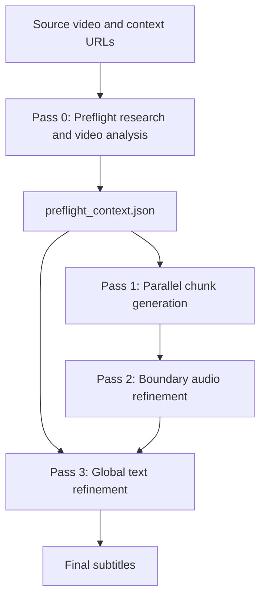
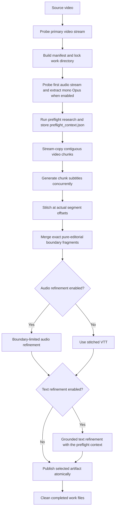

# Video subtitler

This document defines the architecture, data schemas, algorithms, prompt contracts, and operational rules required to recreate the video subtitler pipeline from first principles.

## Purpose

This project is a Go command-line tool that creates English WebVTT subtitles from video.
It uses an audio-first pipeline with four Gemini passes:

1. A preflight pass researches participant identities and topic terminology before chunk generation.
2. Stream-copy video chunks are subtitled concurrently with Gemini Flash.
3. A boundary-limited audio pass listens to the complete extracted audio and repairs faults near chunk boundaries.
4. A grounded text pass improves the complete subtitle script with the preflight research context.

The design targets accurate speech timing, faithful translation, and useful on-screen text.
It favors throughput and resumability.
FFmpeg performs local media work.
The Gemini API performs video interpretation, audio repair, and translation.
Project-owned Go validation checks every structured model response before it reaches the output file.

## System model

The pipeline runs four passes over one work directory:



The normal generation path runs these stages:



The command holds one process lock for the complete work-directory lifecycle.
It also holds a lock for the absolute output path.
The locks cover splitting, audio extraction, API calls, output publication, and success cleanup.

## Repository layout

Every tracked file in this repository has a defined responsibility.

| Path | Responsibility |
| --- | --- |
| `cmd/video-subtitler/` | CLI entry point: repository dotenv loading, argument parsing, validation routing, and dispatch. |
| `internal/core/` | Schemas, timestamps, source titles, URL policy, caption validation, cue classification, speaker casing, sparse audio patches, and repair authority. |
| `internal/storage/` | Atomic JSON publication, file fingerprints, and cache hashing. |
| `internal/vtt/` | Project-owned WebVTT reading, writing, and atomic publication. |
| `internal/media/` | FFmpeg and FFprobe operations for probing, complete audio extraction, and stream-copy splitting. |
| `internal/gemini/` | Gemini clients, prompts, request configs, chunk requests, preflight research, boundary audio refinement, and global text refinement. |
| `internal/pipeline/` | Generation configuration, locking, scheduling, stitching, publication, and the run lifecycle. |
| `bin/video-subtitler` | Ignored repository-local Linux amd64 executable produced by the build. |
| `scripts/subtitle.sh` | Wrapper script that runs generation with terminal context URL prompting. |
| `scripts/yt-dl.sh` | Optional `uvx` and `yt-dlp` helper that downloads VP9/WebM video. |
| `scripts/ffmpeg.sh` | Headless GPL static FFmpeg and FFprobe installer for Linux hosts. |
| `internal/**/*_test.go`, `cmd/**/*_test.go` | Offline behavioral tests organized with their package owners. |
| `AGENTS.md` | Authoritative behavioral and development instructions for agents. |
| `CONTEXT.md` | Complete architectural specification and domain glossary. |
| `README.md` | User-facing installation, usage, and development guide. |
| `go.mod`, `go.sum` | Go module metadata and dependency checksums. |
| `.env.example` | Environment variable template for credentials and model defaults. |
| `.gitignore` | Ignores credentials, caches, generated media, work directories, and subtitle outputs. |
| `.github/workflows/` | Pull-request and `go-rewrite` checks plus selected-ref manual release automation. |
| `docs/agents/` | Agent skill instructions for issue tracking, triage labels, and domain documentation. |

Keep packages on an acyclic dependency graph:
- `internal/vtt` and `internal/storage` are foundations.
- `internal/core` owns domain validation and depends only on `internal/vtt`.
- `internal/media` depends on `internal/storage`.
- `internal/gemini` depends on core, media, storage, VTT, and the upstream Gemini SDK.
- `internal/pipeline` orchestrates core, media, Gemini, storage, and VTT.
- `cmd/video-subtitler` stays CLI-only.

## Runtime requirements

The supported runtime target is Linux amd64.
The binary has no Python, `uv`, or C runtime dependency.
Builds require Go 1.27 or newer.
The optional `scripts/yt-dl.sh` helper retains its separate `uvx` prerequisite.

Direct Go dependencies:
- `google.golang.org/genai` for Gemini API access.
- `github.com/joho/godotenv` for repository-root `.env` loading.
- `golang.org/x/text` for Unicode case folding in speaker-name matching.

Project-owned packages provide WebVTT parsing, serialization, and response validation.

The CLI requires `ffmpeg` and `ffprobe` in `PATH`.
Install headless GPL static binaries via `./scripts/ffmpeg.sh`.

## Configuration

The executable loads the repository-root `.env` relative to its `bin` location when it starts.
The shell environment and CLI arguments can also provide these values.

Configuration values follow this precedence order:
1. Command-line options take precedence over environment variables and `.env`.
2. Process environment variables take precedence over repository `.env` values.
3. Repository `.env` values provide defaults when environment variables are unset.
4. Built-in defaults apply when no option, environment variable, or `.env` entry exists.

| Variable | CLI option | Default | Use |
| --- | --- | --- | --- |
| `GEMINI_API_KEY` | `--api-key` | None | Required Gemini credential. |
| `GEMINI_API_BASE` | `--base-url` | SDK default | Optional Gemini-compatible proxy base URL. |
| `GEMINI_MODEL` | `--model` | `gemini-3.8-flash` | Chunk video model. |
| `GEMINI_AUDIO_REFINE_MODEL` | `--audio-refine-model` | `gemini-3.8-flash` | Boundary audio refinement model. |
| `GEMINI_REFINE_MODEL` | `--refine-model` | `gemini-3.1-pro-preview` | Full-script refinement model. |

The chunk thinking level accepts `minimal`, `low`, `medium`, and `high`.
It defaults to `high`.
`minimal` is valid only when the model name contains `flash` (case-insensitive).
The text refinement pass always uses `high`.
The audio refinement pass always uses `high`.
Every request configured with a thinking level sets `ThinkingConfig.IncludeThoughts` to `true`.
Thought tokens stream in real time across the transport boundary.
These tokens keep the HTTP streaming connection active.
Host stream consumers assemble `GenerateContentResponse.Text()` values only.
That SDK method excludes thought parts from JSON and research text outputs.

### Server-Sent Events (SSE) streaming transport

The Gemini streaming API emits Server-Sent Events (`text/event-stream`).
Responses may contain leading blank lines or repeated CRLF separators between event chunks.
The Go Gemini SDK stream parser rejects leading or repeated empty lines with `iterateResponseStream: invalid stream chunk`.
Every Gemini client instance configures a project-owned `http.RoundTripper` (`sseNormalizingTransport`).
The transport intercepts 2xx `text/event-stream` responses, strips leading or duplicate empty lines, and re-emits clean double-newline-delimited events to the SDK stream iterator.
It leaves non-streaming responses, non-2xx HTTP errors, SDK retries (`HTTPOptions.RetryOptions`), and context cancellations untouched.

Direct CLI defaults:
- `--chunk-dur 60` seconds.
- `--workers 7` API workers.
- `--output output_subtitles.vtt`.
- Audio refinement enabled.
- Text refinement enabled.
- No `--context-url` values.

`--disable-audio-refine` disables boundary audio repair.
`--disable-text-refine` disables global text refinement.
`--refine-only` runs global text refinement directly on an input VTT file.
WebVTT reading and writing preserve `STYLE` blocks, cue identifiers, settings, and text.

## Artifact publication matrix

Generation publishes one artifact based on the refinement toggles:

| Audio refinement | Text refinement | Published input |
| --- | --- | --- |
| Enabled (default) | Enabled (default) | Text-refined `audio_refined.vtt` |
| Enabled | Disabled (`--disable-text-refine`) | `audio_refined.vtt` |
| Disabled (`--disable-audio-refine`) | Enabled | Text-refined `stitched.vtt` |
| Disabled (`--disable-audio-refine`) | Disabled (`--disable-text-refine`) | `stitched.vtt` |

## Video support

`media.ProbeVideoFormat()` asks FFprobe for the primary video codec:

```bash
ffprobe -v error -select_streams v:0 -show_entries stream=codec_name -of default=noprint_wrappers=1:nokey=1 <path>
```

Supported codecs:

| Primary codec | Chunk extension | MIME type |
| --- | --- | --- |
| VP9 | `.webm` | `video/webm` |
| H.264 | `.mp4` | `video/mp4` |
| HEVC/H.265 | `.mp4` | `video/mp4` |

Unsupported codecs such as AV1 return an error.
Audio is mapped with `-map 0:a?` when present.
Subtitle streams are excluded from generated chunks with `-sn`.

## Complete audio extraction

Audio refinement always selects the first audio stream, `0:a:0`.
When audio refinement is enabled, the pipeline probes for `a:0` while holding the work lock.
The run fails before splitting or API calls when the source has no audio stream.

Extraction command:

```bash
ffmpeg -y -i <video_file> -map 0:a:0 -vn -sn -c:a libopus -b:a 64k -ac 1 -ar 48000 -f ogg extracted_audio.ogg.tmp
```

The temporary file is published atomically with `os.Rename()`.
A cached `extracted_audio.ogg` is reused only when FFprobe reports one mono Opus stream at 48 kHz, a positive finite duration, and a duration within 2.0 seconds of the source media duration.
Corrupt or inconsistent audio is regenerated.

## Chunking and segmentation

Stream-copy splitting runs:

```bash
ffmpeg -y -i <video_file> -map 0:v:0 -map 0:a? -sn -c copy \
  -f segment -segment_time <chunk_dur> \
  -segment_list segments.csv -reset_timestamps 1 \
  chunk_%03d<ext>
```

Stream copy cuts at keyframes.
`segments.csv` is the source of truth for chunk start and end times.
Each row contains `chunk_NNN.<ext>,start,end`.
When any nonblank row is malformed or has invalid timestamps, the split is regenerated.
A reusable index must match stored `chunk_NNN` files exactly.

### Chunk generation context

Each chunk prompt carries optional context blocks before the timing rules.
`SOURCE CONTEXT` holds the derived source title with candidate-identity warnings.
`CANDIDATE SPEAKER IDENTITIES` holds the preflight grounded names as a candidate roster.
The roster permits a candidate's canonical English name only when direct in-clip evidence establishes attribution.
Examples of direct evidence include a visible name banner, lower-third, title card, or spoken introduction.
It never assigns identities from appearance alone, and it leaves uncertain dialogue unlabeled.

### Chunk generation retry

HTTP transport errors, 429 rate limits, and 5xx server errors are handled natively by the Gemini SDK.
Every client sets `HTTPOptions.RetryOptions` to `&genai.HTTPRetryOptions{}`, so the SDK makes up to five attempts with exponential backoff and jitter.
Each chunk worker makes up to 3 attempts per chunk to recover from transient host-side response validation failures.
Examples are malformed JSON, a schema violation, inverted timestamps, and a collapsed interval.
A host validation retry waits 1 second after the first attempt and 2 seconds after the second.
A successful attempt publishes the chunk JSON atomically.
Permanent failures do not retry.
Examples are 401 and 403 responses, a missing chunk file, and exhausted SDK retries.
The chunk fails immediately without publishing chunk JSON.
When every host attempt fails, the worker logs the final error and publishes no JSON.
The run stays resumable because valid published chunks are skipped on the next run.

## Structured data schemas

### Chunk generation: `SubtitleResponse`

```json
{
  "captions": [
    {"id": 0, "start": "00:00:00.000", "end": "00:00:01.000", "text": "Text"}
  ]
}
```

### Boundary audio refinement: `AudioRefinementResponse` (`sparse-patch-v1`)

```json
{
  "contractVersion": "sparse-patch-v1",
  "deletedSourceIds": [],
  "cues": [
    {
      "sourceIds": [0],
      "start": "00:00:00.000",
      "end": "00:00:01.000",
      "text": "Replacement"
    }
  ]
}
```

Wire fields use camelCase (`contractVersion`, `deletedSourceIds`, `sourceIds`).
The request uses `ResponseJsonSchema` without unsupported `additionalProperties` keywords.
Host-side decoding rejects unknown fields.
An omitted `deletedSourceIds` field means no deletions and is stored as an empty list in the audio cache.
An explicit `null` is invalid.

### Global text refinement: `RefinementResponse`

```json
{
  "changes": [
    {"id": 0, "text": "Corrected text"}
  ]
}
```

### Preflight context: `PreflightContext` (`preflight-v1`)

```json
{
  "contract_version": "preflight-v1",
  "identity_context": "",
  "terminology_context": "",
  "youtube_context": null,
  "grounded_names": []
}
```

Preflight cache fields use snake_case.
The loader requires the version, identity context, terminology context, and grounded-name list.
It rejects missing or null required fields and unknown fields.

## Timestamp rules

Accepted input shapes: `SS`, `MM:SS`, or `HH:MM:SS`.
The fractional-second part is optional in each shape.
Decimal commas are converted to decimal points.
Output timestamps always use `HH:MM:SS.mmm` rounded to the nearest millisecond.

`core.ValidateCaptions()`:
- Rejects duplicate IDs and non-positive intervals (`end <= start` or `start < 0`).
- Clamps end overruns up to 0.5s beyond chunk duration.
- Rejects cues that collapse to non-positive intervals after rounding.
- Sorts captions by start time and ID.
- Overlapping cues keep their canonical timing.

## Derivation and classification algorithms

### Source title derivation (`core.DeriveSourceTitle`)

1. Basename check: strip subtitle extension (`.vtt`, `.srt`, `.sub`, `.sbv`).
   If a trailing language tag matches `^[a-z]{2,3}(-[A-Za-z0-9]{2,4})?$`, strip it as well.
2. Strip media extension (`.webm`, `.mp4`, `.mkv`, `.mov`, `.avi`, `.m4v`).
3. Return trimmed title.

### Context URL policy (`core.ValidateContextURLs`, `core.ClassifyContextURLs`)

- Each URL must be an absolute HTTP/HTTPS URL with a host.
- Deduplication preserves first occurrence.
- YouTube watch URLs (`youtube.com`, `www.youtube.com`, `m.youtube.com` with `/watch` and `v` param) and share URLs (`youtu.be` with one path segment) route to direct video analysis.
- All other URLs route to Google URL Context tool.

### Cue classification (`core.ClassifyCueText`)

- Parse balanced square brackets by depth and treat each complete outer pair as one visual fragment.
- Nested fragments such as `[[Label] Detail]` remain one exact fragment.
- If no brackets exist in text: `dialogue`.
- If word characters remain outside brackets: `mixed`.
- If only bracketed fragments and whitespace exist: `editorial`.
- Reject any source or candidate audio-refinement cue with an unmatched opening or closing bracket.

### Speaker label pattern

`speakerLabel` matches `^([ \t]*)([A-Z][\pL\pN_' -]{1,30})(:[ \t]*)` from the start of a cue line.
The pattern captures leading indentation, the label, and the colon with its trailing spacing.

### Speaker label casing canonicalization

`core.CanonicalizeSpeakerCasing(cues, groundedNames)` rewrites each speaker label to one canonical spelling per Unicode case-folded label group.
It returns the updated project-owned VTT cue list.

The algorithm runs two passes over non-editorial cues:

1. Collection: every line matching the speaker label pattern adds one occurrence to its casefolded label group.
2. Rewrite: every matched label becomes its group's canonical spelling.
   Leading indentation, the colon with its trailing spacing, and the remaining line text stay unchanged.

Canonical spelling selection per group:

1. A grounded name from `grounded_names` whose casefold equals the group key wins over script frequency.
2. Otherwise the most frequent script spelling wins.
3. Exact frequency ties keep the first spelling seen in the script.

Publication boundary:

- `gemini.Refine()` merges its `grounded_names` argument with the preflight context names and canonicalizes before it saves the refined VTT atomically.
- `pipeline.Run()` canonicalizes without grounded names when it publishes the final artifact directly without text refinement.

## Stitching and pure-editorial boundary merging

Stitching offsets chunk-relative timestamps by each segment's actual `start` from `segments.csv` and sorts by start time.

The stitch pass merges exact pure-editorial cues split at keyframe cuts:
- Adjacent owner chunks.
- Both classify as `editorial` (every line is `[Text]`).
- Trimmed texts match exactly.
- First cue ends within 0.5s of the boundary; second starts within 0.5s of the boundary.
- Merged cue spans from first start to second end with the later owner index.
- Merging repeats until stable.
  Dialogue and mixed cues never merge.

## Boundary-limited audio refinement

Repairs boundary faults by listening to `extracted_audio.ogg`.

Request configuration:
- Default audio refinement model: `gemini-3.8-flash`.
- Fixed thinking level: `HIGH`.
- Thought streaming enabled through `ThinkingConfig.IncludeThoughts`.
- Max output tokens: `65536`.
- Response MIME: `application/json` with `AudioRefinementResponse` schema.
- The Go SDK has no client-side automatic function calling loop, and the request declares no function tools.

### Prompt structure

- Header with audio duration and segment boundaries.
- Numbered script entries: `[0] 00:00:00.000 --> 00:00:05.000 [dialogue]: Text`.
- Boundary rules:
  - Outside repair regions (10s before to 10s after boundaries), source cues must survive identically.
  - Rewrites, retimes, splits, and merges may reference only cues intersecting a shared repair region.
  - Merges must reference contiguous source IDs in script order, but may skip intermediate pure-editorial cues.
  - Recovered cues must have empty lineage (`sourceIds: []`), contain spoken dialogue, have no brackets, and fit inside a repair region.
  - Pure editorial cues must be preserved identically.
  - Mixed cues must preserve their bracketed fragments across descendants.
  - Deletions are allowed only for dialogue cues inside repair regions.

### Candidate reconstruction and publication

1. Host filters the sparse patch to repair authority before reconstruction.
   Patch cues whose referenced source cues all intersect a repair region stay.
   Recovered cues (`sourceIds: []`) stay when their own interval intersects a repair region.
   Deletions stay when their source cue intersects a repair region.
   The host discards every other patch cue and deletion.
   Cues outside repair regions survive as exact copies of their source entries.
   References to unknown source IDs pass through and fail validation.
2. Host expands the filtered patch by inserting exact copies of omitted source cues.
3. Host validates envelope containment, visual fragment multiset equality, and timestamp validity.
   Changed cues may exceed their strict envelope by up to the repair window on each side.
   Recovered cues may exceed a repair region by up to the repair window on each side.
4. Host serializes to `audio_refined.vtt.tmp`, reads back to verify cue equality, and publishes with `os.Rename()`.

## Global text refinement

Refines the full script using grounded identity and terminology research.

### Preflight context (Pass 0)

`gemini.RunPreflight()` produces one `PreflightContext` before chunk generation.
`pipeline.Run()` runs it after audio extraction and before splitting.
It stores the result as `preflight_context.json` in the work directory.
A valid cached file is reused on retry, so no research request repeats.
The cache carries no identity fields, so a retry reuses it as stored.
A successful run removes the file during work-directory cleanup.
The pass uses `Config.RefineModel`, or `Config.Model` when no refinement model is set, with thinking level `high`.

1. **Grounded web research request:**
   - Tool: Google Search + optional URL Context.
   - Output: Plain text with two sections:
     - `PARTICIPANTS AND SPEAKERS`: canonical English public names, aliases, and roles for the people who speak in the video, each entry on its own line starting with the canonical name or stable role followed by a colon.
     - `TOPIC TERMINOLOGY AND PROPER NOUNS`: canonical English spelling of recurring proper nouns, program or series titles, organization names, product names, and locations referenced in the source title or context URLs.
   - Grounded research establishes canonical spelling and verified entities only.
     It never infers, invents, or alters spoken dialogue content, meaning, or events.
   - Grounding verification: The research stream must contain search queries or grounded sources, and every URL Context input must be retrieved successfully.
2. **Direct YouTube video request:**
   - Attached video Parts for public YouTube URLs.
   - Transient server and rate limit errors retry automatically through `HTTPRetryOptions` configured on every client.
3. **Context assembly:**
   - Section splitting: The host splits the research text into identity and terminology sections at the section headers.
     Header matching is case-insensitive with an optional trailing colon.
     Text before the first header stays in the identity section, so research output without headers keeps working as identity context.
   - `grounded_names` collects the canonical name entries (leading `Name:` lines) from the identity section.
   - `youtube_context` keeps the direct analysis text when the response is non-blank.

### Structured refinement (Pass 3)

1. Model: `gemini-3.1-pro-preview` by default, with thinking level `high` and temperature `0.0`.
2. Input: Full script with separate `GROUNDED IDENTITY CONTEXT`, `GROUNDED TERMINOLOGY CONTEXT`, and `DIRECT VIDEO IDENTITY ANALYSIS` blocks.
3. Pipeline runs pass the cached `PreflightContext`, so no research or video analysis request repeats.
4. Direct runs without a preflight context execute Pass 0 first.
   `--refine-only` works this way.
5. Tasks:
   1. Conservative proofreader and minimal patch contract: assumes cues need no change by default.
      It preserves intelligible, grammatical dialogue without stylistic rewriting, synonym replacement, or embellishment.
   2. Objective corrections only: typos, grammar, broken OCR, inconsistent character names and proper nouns, explicit pronoun mismatches, and incomprehensible literal idioms.
   3. Speaker label rules: never adds speaker labels to unlabeled lines.
      It corrects only the spelling, casing, or established identity of existing labels.
   4. Terminology consistency: use the grounded terminology context for canonical spelling of proper nouns, series and program titles, organizations, and location names.
   5. Mixed-cue and visual integrity: mixed cues containing bracketed on-screen text and spoken dialogue must preserve both parts.
      They must never collapse into dialogue-only or graphic-only.
      Editorial cues must preserve bracketed fragments.
   6. Forbid retiming, merging, splitting, adding, or deleting cues.
6. Output: `RefinementResponse` applied atomically to target.

### Speaker label casing canonicalization

1. `core.CanonicalizeSpeakerCasing(cues, effectiveGroundedNames)` runs deterministically after the model changes and before the atomic save.
2. `gemini.Refine()` merges its `grounded_names` argument with the preflight context names.
   Exact duplicates are removed while the first occurrence stays.
   Preflight names win case-insensitive collisions because they come later in the merged list.

## Work state, locking, and recovery

Work directory: `temp_video_chunks/<manifest-sha256-prefix>/` (first 16 hex chars).
Cache identities use Go's `encoding/json` serialization.
Manifest hashes use SHA-256 over those JSON bytes.

Manifest contains:
- `video`: `{path, size, mtime_ns}`
- `chunk_dur`: requested duration
- `format`: `stream-copy-v1`
- `mode`: `generate`
- `model`: chunk model
- `chunk_thinking_level`: thinking level
- `chunk_ext`, `chunk_mime`, `video_codec`

Locking:
- Exclusive non-blocking POSIX `flock` on `.lock`.
- PID written to lock file for diagnostics.
- A hidden sibling `<output>.video-subtitler.lock` serializes writers to the same output path.
- Lock inodes remain in place to avoid unlink races.
- Released automatically on process exit.

Atomic writes:
- Chunk JSON uses a `.tmp` sibling plus `os.Rename()`.
- Preflight context uses `storage.AtomicWriteJSON()` with a `.tmp` sibling plus `os.Rename()`.
- Extracted audio uses a `.tmp` sibling plus `os.Rename()`.
- VTT publication uses `vtt.File.SaveAtomic()` with a random sibling plus `os.Rename()`.

Recovery on retry:
- Valid `segments.csv` and chunk files skip splitting.
- Valid `subtitle_chunk_NNN.json` files skip chunk API calls.
- Valid `extracted_audio.ogg` (mono Opus 48kHz within duration tolerance) skips extraction.
- Valid `preflight_context.json` skips preflight research.
- Valid `audio_refinement.json` matching cache identity skips audio refinement.
- Successful runs clean intermediate work files while holding lock.

## CI and manual release

`.github/workflows/ci.yml` runs for pull requests and pushes to `go-rewrite`.
It checks formatting, runs the race-enabled offline suite, runs `go vet`, checks shell scripts, and builds a static Linux amd64 binary.
CI and release verification install FFmpeg before running media and pipeline tests.

`.github/workflows/release.yml` has only a `workflow_dispatch` trigger.
GitHub exposes that trigger only after the workflow exists on the default branch.
Bootstrap it by merging or copying the workflow file to the default branch without adding push or tag triggers.
Then select `go-rewrite`, a tag, or an exact commit through its `ref` input.
The workflow verifies the selected source, builds it, computes SHA256, and creates the requested tag and release against that exact commit.

## Glossary

**Audio-first boundary refinement**:
Repairs chunk-boundary faults by listening to the complete extracted audio track.

**Boundary envelope**:
A repair region expanded by the full original time extents of referenced source cues and by the repair window on each side.

**Chunk**:
A contiguous stream-copy segment cut from the source video at a keyframe.

**Pure-editorial boundary merge**:
Stitch pass merging identical pure-editorial cues split across adjacent chunk boundaries.

**Repair region**:
The connected union of 10 seconds before through 10 seconds after segment boundaries.

**Segment boundary**:
The source timestamp where one chunk ends and the next begins.

**Sparse patch (`sparse-patch-v1`)**:
Response contract returning only changed, replacement, split, merged, or recovered cues plus deleted source IDs.
